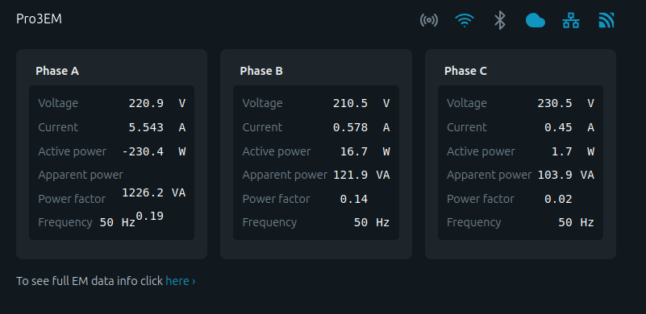
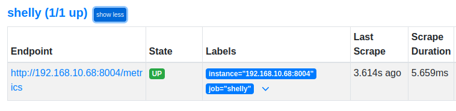
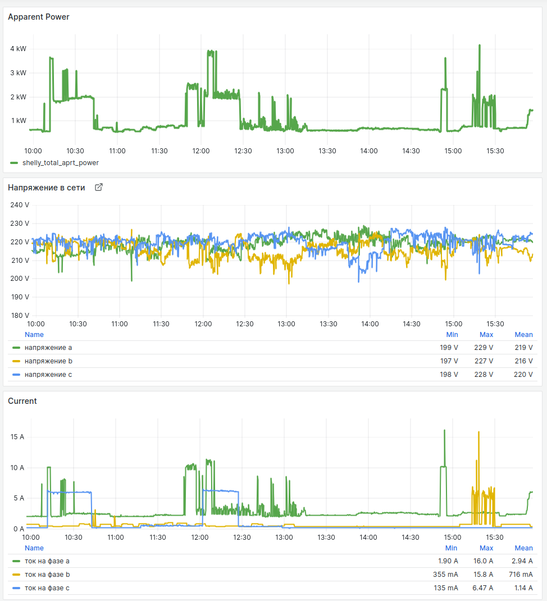

## Overview

This Python script is designed to collect metrics from a Shelly  
device



and expose them to Prometheus for monitoring. 
The script uses Flask to create a web server that Prometheus can scrape for metrics, and the Prometheus client library to define and update the metrics.

### Prerequisites

    Python 3.6 or higher
    Flask
    prometheus_client
    requests

### Setup

    Install required packages:

    
```pip install flask prometheus_client requests```

### Running the Script

    Run the script:

```python shelly_exporter.py```

Verify the script is running:
Open a web browser and navigate to http://<your_server_ip>:8004/metrics. You should see the Prometheus metrics being exposed.


## Integrating with Prometheus

### Configure Prometheus:
Add the following job to your Prometheus configuration file (prometheus.yml):
```
scrape_configs:
  - job_name: 'shelly'
    static_configs:
      - targets: ['<your_server_ip>:8004']
```
### Restart Prometheus:

```sudo systemctl restart prometheus```

#### Verify Prometheus is scraping the metrics:
Open Prometheus' web interface and navigate to the "Targets" page (http://<your_prometheus_ip>:9090/targets). 
Ensure the Shelly exporter target is listed and marked as "UP."





### Integrating with Grafana

#### Add Prometheus Data Source:
Open Grafana and navigate to "Configuration" > "Data Sources."
Click "Add data source" and select "Prometheus."
Set the URL to http://<your_prometheus_ip>:9090 and click "Save & Test."

#### Create a Dashboard:
Navigate to "Create" > "Dashboard" and click "Add new panel."
Select your Prometheus data source and use Prometheus query language to fetch the Shelly metrics (e.g., shelly_current, shelly_voltage).
Customize the panels to display the desired metrics.




#### Save the Dashboard:
Click "Save" and give your dashboard a name.
You can now monitor your Shelly device metrics in Grafana.

By following these steps, you can monitor the metrics from your Shelly device using Prometheus and Grafana.


